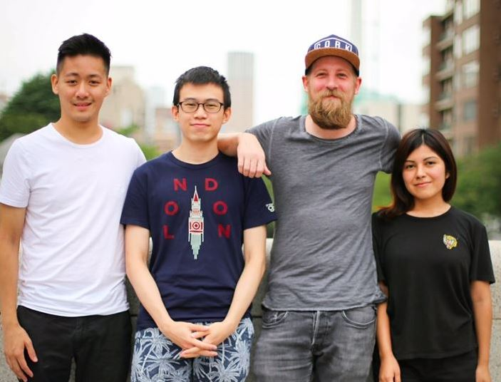

## University - first encounters with coding

I did not study computer science or anything IT related. My major was Japanese Studies (which I loved) and my minor was Media Studies (for which I had strongly mixed feelings...let's say it's the perfect fit for anyone who gets high by analyzing black & white movies from 1920's). 

During my studies I got in touch with the wonderful world of programming by taking some Java classes and basic programming tutorials. These were so much fun that I decided to deep dive into computer science later on. But since I already was pretty much advanced in my regular studies I had to finish those first.

And that also meant of course visiting my beloved Tokyo every now and again...  

## Early working years - a slow start  

The programming game was on again when I got my first job - coding here I come! But I soon realized that learning how to code next to the daily working routine proved to be much harder than expected. And in case you have ever lived and worked in Japan you know what I mean: no time at all in the evening after the many, many hours of overtime, and Sat/Sun are sleep & fun days (it can't get better than a Tokyo party weekend!). 

I also was not quite sure how to build something fun with my basic Java skills, and so I was a bit at loss for some time...

Luckily I chose a profession which was kind of close to the stuff I wanted to learn. So while working as a IT-Consultant implementing ERP systems all over the planet, I could at least touch program code in the form of design documents and testing/debugging. Being a consultant also has its benefits and needs its own skill set which comes in handy quite often when there are problems to be analyzed, clients to be convinced or just by being amazing in Excel and Powerpoint. 

## Le Wagon bootcamp - the time of my life

But designing and testing financial programs in a strange language (anyone knows ABAP...?) didn't really satisfy me. So I decided to take unpaid leave for two month and enrolled into the [Le Wagon](http://lewagon.com) web-developer bootcamp in Meguro, Tokyo. 

Best decision EVER! 

Honestly. I had so much fun I couldn't believe myself. After a wonderful time with awesome people and great teachers I finally decided on what to do: a career in the tech-world!

We all got a good grasp of the following skills in that 9 weeks:

1. **Ruby on Rails** as backend language 
2. **HTML, CSS & JavaScript** for frontend
3. **GitHub, git & Linux** for version management 
4. **Postgresql and SQL** for database control 
5. Various product management & design tools 

I miss my team members. Cheers to you!

## Same job, different role - full deep dive into coding

Equipped with my new Full-Stack coding skills I went back to my company and asked for a position as a developer. They were happy to put me into the IoT (Internet of Things) sector where we create and sell solutions and services to bring digital transformation to our clients. Here I am now - a member of the development team building awesome applications and cloud infrastructure for global projects and international clients. 

I can finally code from morning to evening, learn a ton of different languages and frameworks (lately e.g. **Java Spring Boot, Python Flask, Node Express**) as well as working with **Cloud providers** on a pretty deep level (especially [AWS](http://aws.com)). 

I even got the chance to build a **Deep Learning model** for Object Detection using Transfer Learning with **Tensorflow** while rewriting an applications build in [ROS](http://ros.org) (**Robot Operating System**) running on an **Nvidia Edge Server**. Check out my [Projects Page](/projects) to find out more about some of the projects I did so far. 

Cheers!