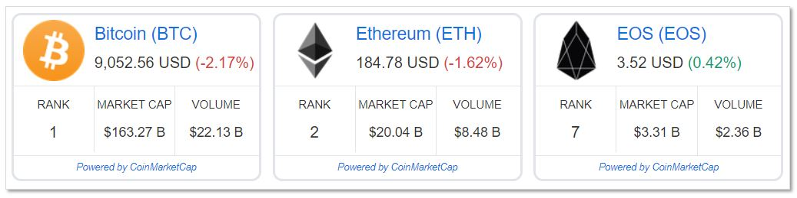
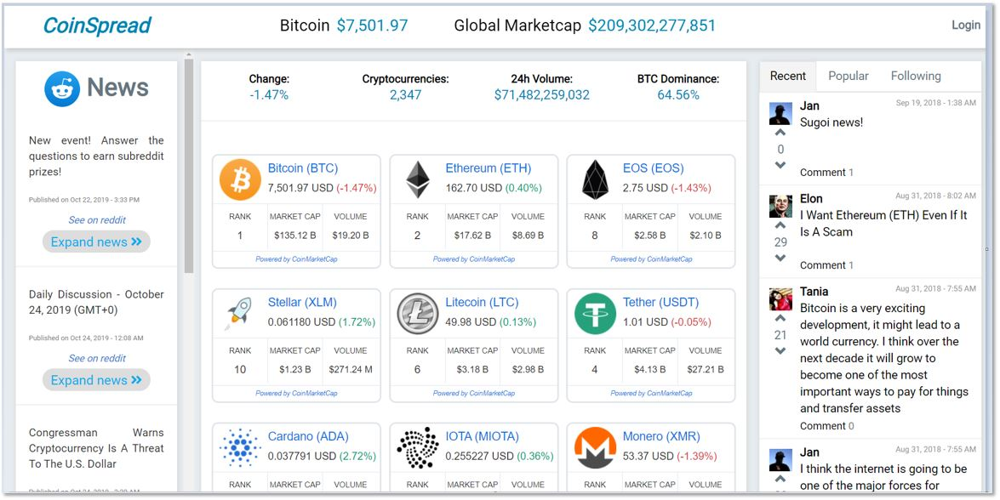

Our final project at the Le Wagon bootcamp in Tokyo (July/August 2018) was a tough and a fun one at the same time: 

_Tough_ because we barely had two weeks to go from the initial idea to a full-fledged web app. And then we had to pitch the app in front of about 100 people coming to Impact Hub for our final batch presentations (thanks David!). 

But it was also _fun_ because we could finally create something cool out of nothing (well, not exactly nothing since we used established frameworks, existing languagues and other resources available). This feeling of being able to use an abstract language to create a functioning and (hopefully) useful website was what hooked me after all to follow my career in the tech-world.  

### So what did we create? 

We, that is four coding students from different professions and countries (Peru, China, US and Germany), created a **One-Stop Shop for Crypto Currencies** monitoring prices and news mixed with social media. Check out the link to our [Coin-Spread Page](http://www.coin-spread.com) (still running on Heroku after all this time).



The idea behind **Coin-Spread** (as well as the _doubtful_ name...) had our buddy and business team lead David. He works in Finance and while dealing with crypto currencies he was lamenting that, although a lot of crypto dashboards do exist, not one of them could make you _communicate with like-minded peeps_ to exchange messages about latest events and newest investments. So we created a crypto dashboard with all informations needed while including a posting board and messenger service to create networks between people. We also added a portfolio page where one can log in and track his/her current crypto-wealth (...or loss when you invested after December 2017).

### The stack we used

Le Wagon teaches students in 9 weeks how to code mainly by using a lot of design tools (e.g. **Figma**), front-end languagues (**CSS, HTML & JavaScript**), **Postgresql** as open source database, and one back-end language with its awesome web app framework: **Ruby on Rails**.


Although its icon looks like a red kraken (its supposed to be a railway), Ruby on Rails is an easy to grasp framework and it lets you create big and secure CRUD (**C**reate, **R**ead, **U**pdate, **D**etele) webapps in a short time. Ruby, the languague behind the Rails framework, was designed by the Japanese computer scientist Yukihiro "Matz" Matsumoto in the 1990's (coincidence that our bootcamp was located in Tokyo, Japan...? Actually, yes since they also teach Ruby in France at Le Wagon). Ruby is pretty simple compared to "older, bigger" languages like C++ or Java. Here is a comparison of printing out "Hello World!" in Java and Ruby:

##### Java's "Hello World!"

```java
class HelloWorld 
{ 
    public static void main(String args[]) { 
        System.out.println("Hello World!"); 
    } 
} 
```


##### Ruby's "Hello World!"

```ruby
print "Hello World!"
```


Can you spot the difference? While Java needs a class as well as a "main" method to start printing "Hello World!" (in total _six lines_!), Ruby just needs one line (a bit like **Python**). Pretty damn simple und useful too! 

The Rails framework follows the **model-view-controller (MVC)** pattern widely used in other frameworks too. And because of its coder-friendly realization you will be pretty spoiled when you need to develop something in for example Java Spring Boot (so many lines of unnecessary code in the eye of a Ruby on Rails programmer!).

The best thing however is, that after learning one framework like Ruby on Rails, you will have no problems when migrating to other frameworks like **Python Django or Flask**, **Node Express** or even **Java Spring Boot** (if you really have to).    

After this little excurse into wep app frameworks, please check out our [Crypto Dashboard](http://www.coin-spread.com)!

Cheers to Rails! 
