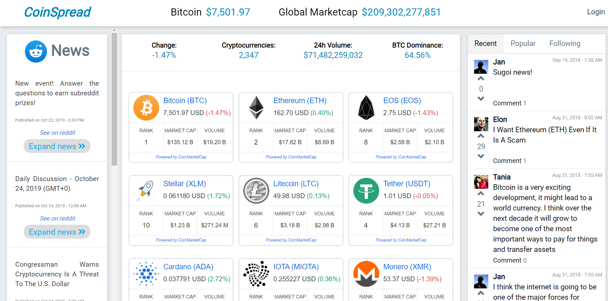
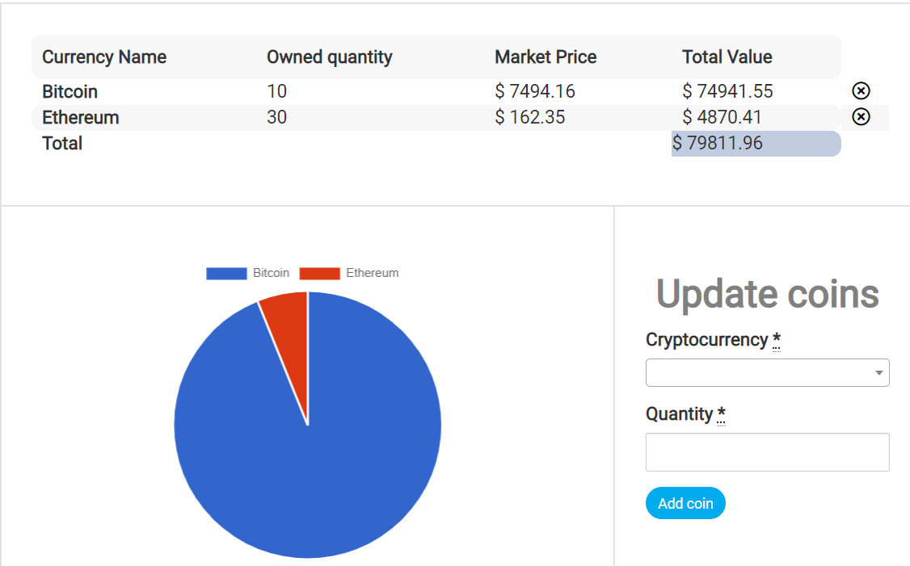

During my second bigger project at the Le Wagon bootcamp, my three team mates and me created a **one-stop shop shop for monitoring prices, news and posts for Crypto Currencies**. Our time was limited but all teams delivered amazing prototypes during our last week at the bootcamp.

The idea behind the "coin-spread" crypto dashboard had our buddy and biz-team lead David. He works in Finance also dealing with crypto currency and he was lamenting that although a lot of crypto dashboards do exist, not one of them could make you communicate with like-minded peeps as in social network to exchange messages about latest events. We also added a portfolio page where one can log-in and track their current crypto-wealth (...or damage).

[salted duck eggs](http://en.wikipedia.org/wiki/Salted_duck_egg).

