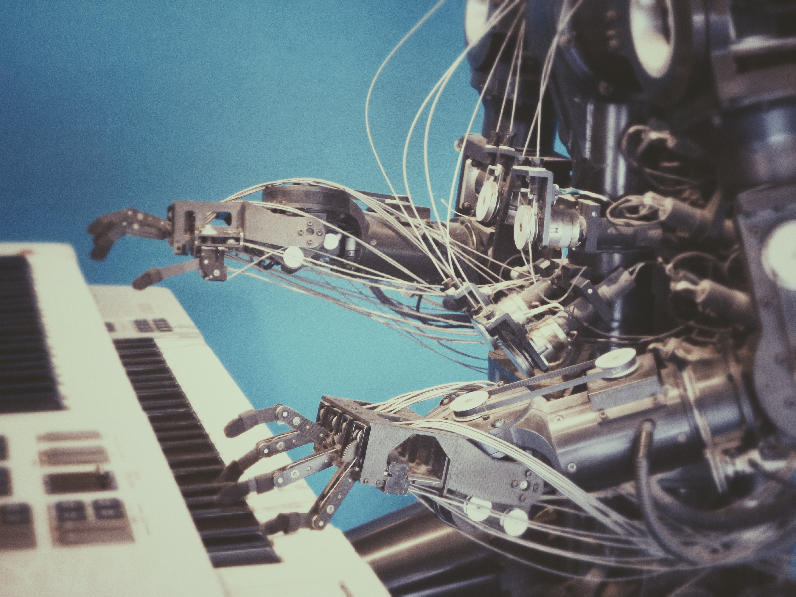

I always thought that the realms of Deep Learning and Data Science were reserved for PhD students and insanely smart geeks calculating complex models on high-end computers. 

Well, for the ongoing research in Deep Learning the PhD student part is definitely true. But if you use certain freely available tools and methods to apply Deep Learning to real world problems it is actually comparatively easy to get started with and a lot of fun! Google's [Tensorflow Object Detection API](https://github.com/tensorflow/models/tree/master/research/object_detection) or Facebooks [Pytorch](https://towardsdatascience.com/object-detection-and-tracking-in-pytorch-b3cf1a696a98) are pretty handy and well-architectured frameworks to start with. Combine this with transfer learning (a method of training an existing model to recognize additional stuff e.g. [Pokemon](https://towardsdatascience.com/detecting-pikachu-in-videos-using-tensorflow-object-detection-cd872ac42c1d)) your imagination is your only boundary (of course there are some drawbacks but still it works really well). 

### A whole new world of detection

The project I got assigned to uses Deep Learning for **object detection**, a method to detect pre-trained objects inside a frame while also telling you where these objects are by applying a bounding box around it. There are other Deep Learning areas like **image classification** (classifying the whole image to a category e.g. "National Park", "Desert" etc.) or **natural language processing** (detecting words and sentences out of spoken or written language). 

Deep Learning is just one part of a broader world of Machine Learning with many more applications. But you have to start somewhere and object detection is definitely an interesting way to deep dive into Deep Learning. 

I won't go too much into the details of my project here (and I can't due to disclosure issues), but in general we built an **_edge-server_** (as opposite to a **_cloud-server_** like an **Ec2 on AWS**) connected to a camera (drive-recorder) and a GPS-card to recognize objects on the road while driving in your car. This can be signs on the road like stop signs or even other cars and their number plates. The really fun thing is to combine this with an **OCR model** to actually read what the signs says (e.g. "30 miles to Tokyo").

Training the model took me sometime because I had to figure out how transfer learning works with Tensorflow (different versions in basically all necessary programs from Linux to Pyhton to CUDA drove me nearly mad!). But after completing the setup of the training environment (I used an **AWS Ec2 instance** with a nice big GPU attached), you just need some nice data and the fun begins (haha, you wish!). 

### Annotation hell

Data means in our case lot's of pictures while driving down the highway. My colleague took up the challenge and recorded some parts of his way to his weekend camping trip. I took the video, split it into 24 frames (= jpgs) per second and classified the pictures into different categories by hand (this is of course what we want to let the model do for you in the future).

I remember it took me nearly half a day for all 1000 pictures to draw the annotation box around the object and name the file (this pretty [awesome annotation tool](https://github.com/tzutalin/labelImg) came really in handy). Now I could finally train the model and after a few tries (be careful of OpenCV's [color handling of RGB](https://www.learnopencv.com/why-does-opencv-use-bgr-color-format/)!) it finally worked: 

I had a fully functioning model trained in just a few days without much prior knowledge of Machine Learning and Deep Learning. A great feeling!

### Into robotics

Another reason why this project was awesome was that I got in touch with a framework called [ROS (Robotic Operating System)](https://www.ros.org/). We didn't do any robotic arms or self-drving capacities in our project but nevertheless ROS is sometimes a great option in case you want your application to run autonomously. This meant in our case: switch it on and let it run without any user control (there wasn't even a UI to control the app e.g. while driving in the car). 

So because of this project I got into Deep Learning and Robotics at the same time - _how cool is that_? 

I could even visit this years [ROS Con](https://roscon.ros.org/2019/) (yes, there is a big community around ROS) to meet all kinds of people and learn about projects using ROS in commercial robots and science around the world. In case you still wonder what ROS is all about: in short, ROS makes it possible to create robotic applications and robots more easily since it is open source, so you don't have to spend your first million dollars to create a functioning framework yourself to get your robot run. 

Happy Deep Learning and robot development everyone!

