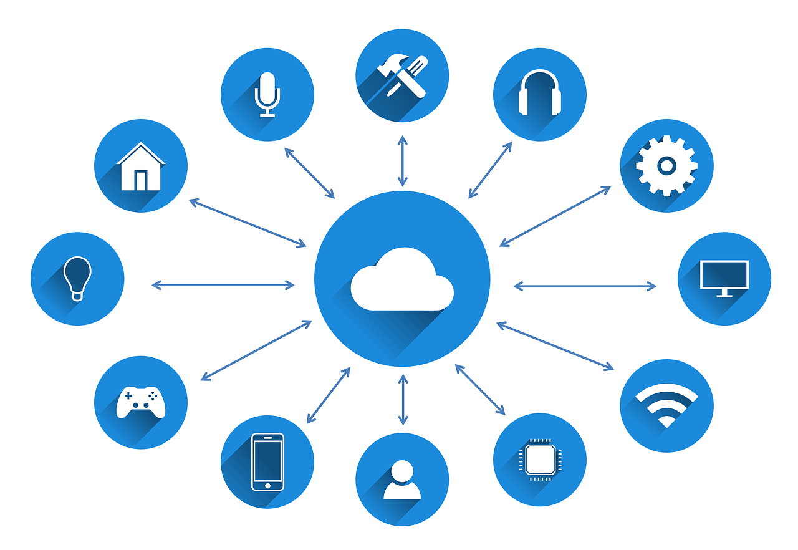
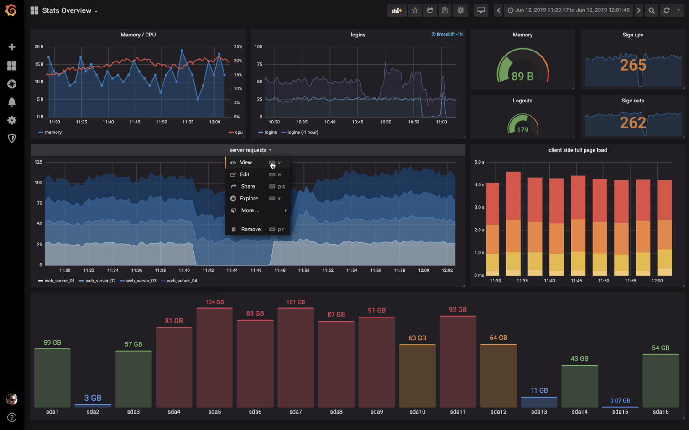

The term **Internet of Things** always made me curious, but when it came down to explain it I was a bit at a loss. Like its trendy sibling **Artificial Intelligence** you can read it everywhere like an omen for a new age, but what does it actually mean when you work in this field? 

Being back at my company after a two months break from work to learn building web apps at [Le Wagon](https://www.lewagon.com/) bootcamp, I discussed with my boss what I could do to help the company with my coding skills. He put me in the rather new "Internet of Things" sector - and here I am (still), consulting clients about how to adopt **Industry 4.0** (another big word) and building solutions to support their digital transformation needs. 

Since then I learned quite a bit about IoT. Especially that it is not only about the coffee machine communicating with the toaster as to when coffee and toast should be ready (although coffee and toast are really nice together). Our sector is working with clients to bring ideas of Industry 4.0 to their companies, that is, mainly their factories.

### What is Industry 4.0?

When I talk about Industry 4.0 I mean all the new areas that are hyped lately including **AI, IoT, Cloud and Edge Computing** and other cool sounding stuff, and put it to use in industrial manufacturing. This is foremost to help the client stay competitive, not the least in light of new consumer demands like **individualized products** to be ready **on-demand**. 

Since we are the IoT sector, out of all this new cool stuff out there we mainly focus on IoT (sounds logical). If you take the idea of IoT to a manufacturer, the first thing which comes to mind is to make use of all the data you can collect inside your manufacturing process (that is a lot I can tell you!). This can either be data formerly written on paper by the factory staff, but also sensor data from the environment and all those **PLCs** (small computers used to control equipment and machinery) just waiting to be streamed and collected for further analysis. 

### What we build to help factory management in their daily struggle

It would be great if the management could actually see all those data in one place, right? So the first step after collecting sensor data from equipments and other sensors is to _visualize_ that data in a way to help the management make better decisions. And that was my first task 
<i class="em em-japanese_goblin" aria-role="presentation" aria-label="JAPANESE GOBLIN"></i>
<i class="em em-bar_chart" aria-role="presentation" aria-label="BAR CHART"></i> 

My team and me built a platform to collect sensor data out of various sources and visualize it in realtime on a dashboard. This we inlcuded into a nice little app in order for you to drill down into your factories, processes and lines right up to your sensors to have everything under your control. 

We also built an alert system to send notifications to the maintenance team when equipment sensors are above or below a certain threshold. This is to help prevent unwanted shutdowns due to equipment failure. The next step is now to use a machine learning model to actually predict these shutdowns. In case you have fitting data you can use for example [Amazon Forecast](https://aws.amazon.com/forecast/?nc1=h_ls) to easily create a model. 

### My first Cloud architecture solution

For the app we used **Java Spring Boot** - a nice web app framework, but if you are used to Python or Ruby you will be surprised how much code you need to write! 

Until the data arrives at the app it has to go through the network and a few Cloud services for data preparation and storage. We used [AWS](https://aws.amazon.com/) (as most people nowadays - it has a market share of a stupendous 50%). As services we chose the following to create our IoT platform:

- IoT Core
- Kinesis Firehose
- S3
- ElasticSearch

The data from the sensors are sent to AWS IoT Core via **MQTT protocol** in **timeseries format** so that is can be queried easily. Kinesis Firehose is directing the data into S3 for storage (actually only the necessary part of the data) and also to ElasticSearch, a popular query database (open source available too right [here](https://www.elastic.co/)). We used ElasticSearch because it is excellently integrated into [Grafana](https://grafana.com/), another really popular open source tool to create awesome dashboards super fast and easy (and it looks really cool too). 

In Grafana you can create histograms, set thresholds and alerts, send push notifications, and of course you can integrate your dashboards into your app - and that's what we did. You can now drill down to your process and examine each sensor in realtime while properly maintaining your equipment to minimize production loss by preventing downtime.

Cheers to new technology!
<i class="em em-floppy_disk" aria-role="presentation" aria-label="FLOPPY DISK"></i>
<i class="em em-champagne" aria-role="presentation" aria-label="BOTTLE WITH POPPING CORK"></i>

