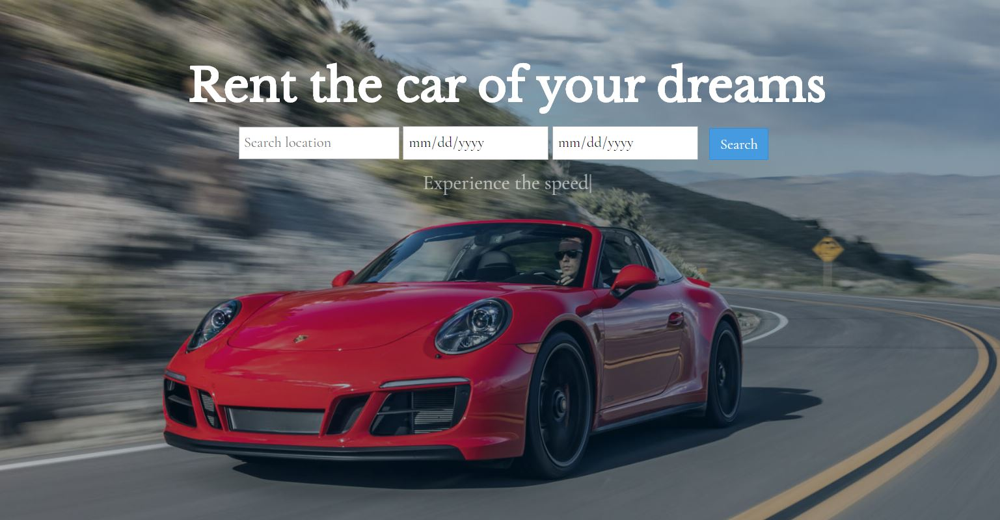
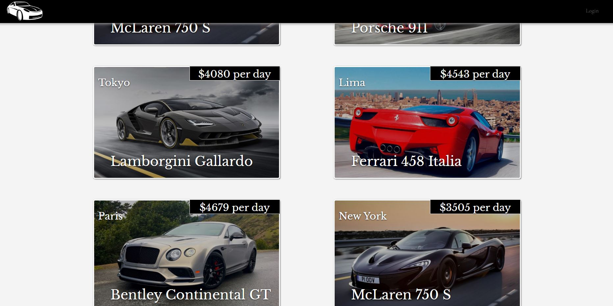

Here's to all the people who want to look rich for one day: Rent your high class car and live your dream! 

At least until your money runs out... Super Cars was our first project during the Le Wagon bootcamp. In a total of 4-5 days we, my three team mates and me, did our first team work after a long seven weeks of solo-coding. There were two goals to this exercise:

**1.  Create a marketplace web app (anything like Airbnb) from scratch**

This is to make yourself comfortable with coding in a team to complete a prototype in a really short amount of time (final pitch I see you coming!).

**2.  Combining all the things we learned to create a working prototype** 

Combining design tools, front-end (mainly **CSS, HTML, JavaScript**) and back-end (**SQL and Ruby on Rails**), to create our first fully working web app which we can put on our resume (well, at least if you want someone to see it). 

### The stages of developing a product  

A product sprint until the final pitch has about the following steps:

1. Decide for an idea and create a business plan
2. Create a mock-up to determine all functions and the design
3. Create the database schema and the routings
4. Start with back-end and front-end coding
5. Test your prototype back and forth and forth and back again
6. Prepare your pitch 
7. Pitch!

To actually create a working prototype you need an idea. So, after long discussion and many mugs of coffee (we had also Island and Airplane rental shops in mind), we settled for a car rental site where people can rent out their high class cars while others can rent these for a specific time.

The idea (=business model) leads to a first design without coding yet. We used [Figma](https://www.figma.com) to create an actually clickable kind of Powerpoint like version of our app. This stage (and tool) is especially useful when presenting to an audience (e.g. your client) in order to make sure you included all the necessary functions and propose a nice design. By the way, you can actually use Figma to generate all the front-end code out of your mock-up app but I never tried if it really works (it would take a lot of fun away too!).

OK, the design is fixed - what's next? The **database** and **routes design** of course. For people who prefer designing websites and powerpoints by using shapes, colors and fonts, this is probably the hardest part. Since this web app will be a CRUD (**C**reate, **R**ead, **U**pdate, **D**etele) app, you need to store a lot of things into a database to be able to recall them later. This can things like car models, pictures (specificially their addresses in the web), car prices, user login data and many more.

Designing database schema is actually pretty abstract and must be done well in order to be link all data that belongs together. Later changes are possible but a nuisance especially in production, so plan and design well!

**Routes** are another topic to plan before the actual coding starts. A route is the address to a page or sub-page of your app which could include the list of all cars, the detailed page of a specific car before booking or the booking process of that car. Ruby on Rails helps you with this process by adding id's of e.g. your car automatically to the route of the specific detailed page, so its actually pretty easy. 

### The coding starts

Now we are ready to code, right? Yes, but please make sure you use a project management tool (Excel is fine too!) to keep track of each members tasks! So divide your team into front-end and back-end developers (and a team lead if possible) and start coding! You only have two and a half days left till your pitch. 

To make it quick - we had one front-end developer, one back-end developer, a biz team lead and a developer team-lead (that was me by the way). I had the pleasure of merging all git pull requests into our master. Not always easy and I can fully understand if dev-leads let their people do the testing and merging locally first by themselves.

This is how our landing page looks:

You can search for a location and time and get a list of available cars ready to book. Of course this is just a prototype so no real cars in there. That also meant we had to add **seeds** to the database, meaning pictures and prices and all the other necessary data to show a working page whithout going live yet. The seeds need to be realistic or otherwise you will not convince investors to give you money in building the real deal.

But the pictures also have to look cool so we chose a lot of probably too expensive cars which might never be listed: 

Don't forget to test your prototype before the pitch and do not touch the code the day of the pitch! Actually about one our before our pitch we noticed that the cars are coming out in the wrong order. Not that big a problem but it disrupted the story of our pitch somehow. Luckily it was an easy fix but you really start getting nervous touching code which will be presented to a hundred people in under one hour...

You can check out our [super cars protoype here](https://supercarslewagon.herokuapp.com) - have a look!

